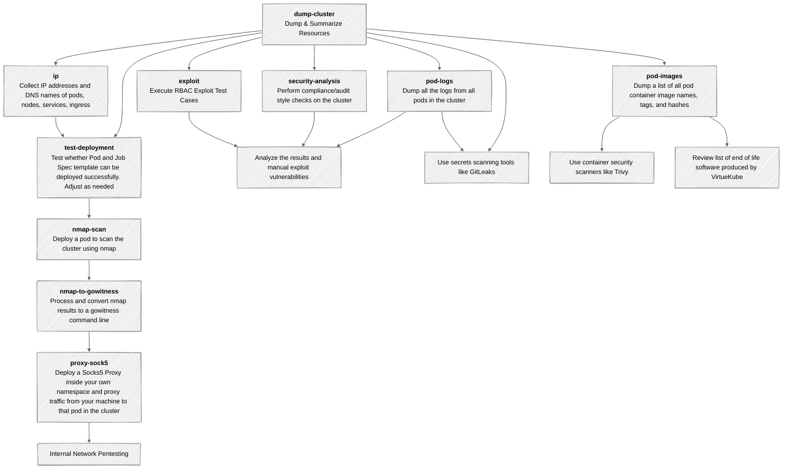

<!-- TOC -->
* [VirtueKube](#virtuekube)
  * [Command-Line](#command-line)
    * [VirtueKube List of Subcommands](#virtuekube-list-of-subcommands)
    * [Dump and Summarize Cluster Resources](#dump-and-summarize-cluster-resources)
    * [Extract IP Addresses and DNS Names](#extract-ip-addresses-and-dns-names)
    * [Collect Pod Logs](#collect-pod-logs)
    * [Test whether the Default Pod and Job Spec is Accepted by the Cluster](#test-whether-the-default-pod-and-job-spec-is-accepted-by-the-cluster)
    * [Run Policy Test Cases to Identify Gaps in Enforcement](#run-policy-test-cases-to-identify-gaps-in-enforcement)
    * [NMap Scan (Inside The Cluster) Correlated to Cluster Namespace and Resource](#nmap-scan-inside-the-cluster-correlated-to-cluster-namespace-and-resource)
    * [Convert NMap Results to GoWitness Command Line](#convert-nmap-results-to-gowitness-command-line)
    * [Deploy Socks5 Proxy](#deploy-socks5-proxy)
    * [Run Compliance/Audit Style Analysis](#run-complianceaudit-style-analysis)
    * [Try to Exploit RBAC - Currently focused on JWTs and Service Accounts](#try-to-exploit-rbac---currently-focused-on-jwts-and-service-accounts)
  * [Installation](#installation)
    * [Prerequisites](#prerequisites)
    * [Building from Source](#building-from-source)
  * [Penetration Testing Workflow](#penetration-testing-workflow)
  * [Credits](#credits)
    * [About Virtue Security](#about-virtue-security)
  * [Acknowledgments](#acknowledgments)
<!-- TOC -->

# VirtueKube


Coming Soon!
- B-Sides Denver 2025 Conference Presentation Video
- OWASP AppSec USA 2025 Conference Presentation Video

[VirtueKube](https://github.com/VirtueSecurity/VirtueKube) is a command-line utility for Kubernetes cluster penetration testing. It helps security professionals and administrators:

- Perform information gathering
- Extract relevant information
- Point out interesting resources to target
- Identify vulnerabilities
- Exploit issues at scale across the cluster

To use this tool, you will need:

- A read-only user that can see all resources in the cluster
- A simulated compromised developer account within its own empty namespace in the cluster

This context can be used to simulate threats from the following perspectives:

- A pod with a remotely exploitable RCE vulnerability
- A pod that is already compromised
- A developer accidentally deploying a pod containing malware
- A developer account that is compromised
- A malicious developer in a multi-tenant cluster trying to cause harm to other teams' workloads

The subcommands for VirtueKube help with the following tasks:

- Dump all resources in the cluster and summarize resource count by namespace
- Test misconfigured RBAC controls (even if you can't list the resources)
- Find open ports within the cluster across namespaces, nodes, and pods, regardless of port declarations in resource specs
- Access JWTs or create JWT by executing into/copying from pods or by trying to `kubectl create token` on service accounts
- Proxy traffic through a pod in your namespace to access the rest of the cluster through a Socks 5 proxy and a `kubectl port-forward` from your own computer
- Dump Kubernetes resource specs and pod logs for manual review as well as use of tools like gitleaks
- Facilitate running tools like Trivy against the container images identified based on their hashes
- Identify end-of-life container images and software in container images based on docker image specs and environment variables
- Run cluster policy test cases to make small changes to a valid pod spec to identify whether policy agent rules are being enforced, one tiny change at a time (much more granular view)
- Audit/Compliance type checks for resources across the cluster, but especially the identification of pods running with elevated privileges or with host path mounts (great targets to focus on)

This tool is built by Nick Coblentz at [Virtue Security](https://www.virtuesecurity.com) as part of the company's suite of tools used during single and multi-tenant Kubernetes cluster penetration testing engagements.


## Command-Line

- `online` means the VirtueKube will use the currently configured user for `kubectl` to authenticate and access the cluster to perform that task
- `offline` means VirtueKube will use the `all.json` file extracted from the `dump-cluster` sub-command without connecting to the cluster

### VirtueKube List of Subcommands

```bash
$ java -jar build/libs/VirtueKube-0.1-all.jar -h

Usage: java -jar virtuekube-all.jar [<options>] <command> [<args>]...

  VirtueKube is a command line utility to dump all the resources in a Kubernetes Cluster, harvest information that aids in pentesting the cluster, run security test cases and report on the results, and exploit a selection of issues.

Options:
  -c, --config=<text>      Path to kube config file
  -o, --output-dir=<text>  Output directory to save exported resources
  -h, --help               Show this message and exit

Commands:
  dump-cluster       (online) Dumps all resources in the cluster (This command must be run first)
  ip                 (offline) Dump all IP Addresses associated with pods, nodes, services, and ingressroutes
  pod-logs           (online) Collect all Pod Logs  
  pod-images         (online) Extract Pod images, generate trivy commands, pull images from the repo (requires docker login already set up)
  deploy-test-cases  (online) Deploy workloads to the cluster to test out specific controls
  nmap-scan          (online) Perform an nmap scan inside the kubernetes cluster
  nmap-to-gowitness  (offline) Process nmap XML scan results and extract URLs for HTTP/HTTPS services
  test-deployment    (online) Test deployment of job-template.yaml and pod-template.yaml to the Kubernetes cluster
  proxy-socks5       (online) Deploy a SOCKS5 proxy pod and set up port forwarding on port 1080
  security-analysis  (offline) Analyzes Kubernetes resources for security concerns
  exploit            (online) Attempts to exploit potential vulnerabilities in the Kubernetes cluster. Uses the all.json file as the source of targets.
```

### Dump and Summarize Cluster Resources

> Run this command as the Read Only kubectl user

The command will:
- Retrieve all resources from the Kubernetes API server
- Organize resources by namespace and resource type
- Generate summary reports in CSV and Markdown formats
- Extract Helm release information
- Save all data to the output directory

```bash
$ java -jar build/libs/VirtueKube-0.1-all.jar dump-cluster -h

Usage: java -jar virtuekube-all.jar dump-cluster [<options>]

  (online) Dumps all resources in the cluster (This command must be run first)
  
$ java -jar build/libs/VirtueKube-0.1-all.jar dump-cluster

Found 3 componentstatuses 
Found 62 configmaps 
Found 37 endpoints 
Found 512 events 
Found 0 limitranges 
Found 15 namespaces 
Found 1 nodes 
Found 0 persistentvolumeclaims 
Found 0 persistentvolumes 
Found 31 pods 
Found 0 podtemplates 
...
Wrote 445 resources for namespace cluster-wide to /../output/bynamespace/cluster-wide.json 
Wrote 445 resources for namespace cluster-wide to /../output/bynamespace/cluster-wide.yaml 
Wrote 64 resources for namespace capsule to /../output/bynamespace/capsule.json 
Wrote 64 resources for namespace capsule to /../output/bynamespace/capsule.yaml 
Wrote 67 resources for namespace cert-manager to /../output/bynamespace/cert-manager.json 
Wrote 67 resources for namespace cert-manager to /../output/bynamespace/cert-manager.yaml
...
Wrote Helm File at: /../output/helm/helmList.md 
Wrote Helm File at: /../output/helm/helmList.csv 
Wrote Resource Summary CSV at: /../output/all/resource-summary.csv 
Wrote Resource Summary Markdown at: /../output/all/resource-summary.md 
Follow Up Command gitleaks dir /../output/all.yaml -f csv -r gitleaks-all-yaml.csv 
Follow Up Command gitleaks dir /../output/helm -f csv -r gitleaks-helm-dir.csv 

```

### Extract IP Addresses and DNS Names

> This command is run offline, doesn't matter which user you run it as

Output files:
- `podips.txt`: IP addresses of all pods
- `nodeips.txt`: IP addresses of all nodes
- `serviceips.txt`: IP addresses of all services
- `podipandports.txt`: Pod IP addresses with their exposed ports
- `servicednsandports.txt`: Service DNS names with their exposed ports
- `ingressrouteipsandports.txt`: Ingress route IP addresses and ports


```bash
$ java -jar build/libs/VirtueKube-0.1-all.jar ip -h

Usage: java -jar virtuekube-all.jar ip [<options>]

  (offline) Dump all IP Addresses associated with pods, nodes, services, and ingressroutes

Options:
  -d, --dump=true|false  Dump
  -h, --help             Show this message and exit

$ java -jar build/libs/VirtueKube-0.1-all.jar ip

Wrote to /mnt/secondencrypteddrive/projects/KubePentest/output/ips/podipandports.txt 
Wrote to /mnt/secondencrypteddrive/projects/KubePentest/output/ips/nodeips.txt 
Wrote to /mnt/secondencrypteddrive/projects/KubePentest/output/ips/podips.txt 
Wrote to /mnt/secondencrypteddrive/projects/KubePentest/output/ips/ingressrouteipsandports.txt 
Wrote to /mnt/secondencrypteddrive/projects/KubePentest/output/ips/servicedns.txt 
Wrote to /mnt/secondencrypteddrive/projects/KubePentest/output/ips/serviceips.txt 
Wrote to /mnt/secondencrypteddrive/projects/KubePentest/output/ips/servicednsandports.txt 
Caution ingress, ingressRouteTcp, and ingressRouteUdp are not yet supported. Run `kubectl get` for each of those resources 
```

### Collect Pod Logs

> Run this command as the Read Only kubectl user

The command will:
- Retrieve logs from all containers in all pods
- Save logs to individual files in the `output/podlogs` directory
- Name files using the format `namespace-podname-containername.txt`


```bash
$ java -jar build/libs/VirtueKube-0.1-all.jar pod-logs -h

Usage: java -jar virtuekube-all.jar pod-logs [<options>]

  (online) Collect all Pod Logs

Options:
  -h, --help  Show this message and exit
  
$ java -jar build/libs/VirtueKube-0.1-all.jar pod-logs

Pod logs saved to /mnt/secondencrypteddrive/projects/KubePentest/output/podlogs 
Found 39 logs 
```


### Test whether the Default Pod and Job Spec is Accepted by the Cluster

> Run this command as the simulated compromised developer kubectl user
> Note: the output from the pod or job shouldn't necessarily report as running as root successfully. Simply receiving output indicates success.

- Update the Pod and Job specs by modifying `testCases/job-template.yaml` and `testCases/pod-template.yaml`

```bash
$ java -jar build/libs/VirtueKube-0.1-all.jar test-deployment -h

Usage: java -jar virtuekube-all.jar test-deployment [<options>]

  (online) Test deployment of job-template.yaml and pod-template.yaml to the Kubernetes cluster

Options:
  -n, --namespace=<text>     Namespace to deploy to
  -j, --job-template=<text>  Job template file
  -p, --pod-template=<text>  Pod template file
  -t, --timeout=<int>        Timeout in seconds for waiting for deployments
  -h, --help                 Show this message and exit

$ java -jar build/libs/VirtueKube-0.1-all.jar test-deployment -n team-b-test

Job Deploying job test-job-1760973196311 to namespace team-b-test 
Job 'test-job-1760973196311' Status: Active=1, Succeeded=0, Failed=0 
Job 'test-job-1760973196311' Status: Active=1, Succeeded=0, Failed=0 
Job 'test-job-1760973196311' Status: Active=1, Succeeded=0, Failed=0 
Job 'test-job-1760973196311' Status: Active=0, Succeeded=0, Failed=0 
Job 'test-job-1760973196311' Status: Active=0, Succeeded=1, Failed=0 
Job 'test-job-1760973196311' succeeded. 
Success Job 'test-job-1760973196311' completed successfully 
Job Status Name: test-job-1760973196311 
  Active: 0 
  Succeeded: 1 
  Failed: 0 
  Completion Time: 2025-10-20T15:13:25Z 
  Start Time: 2025-10-20T15:13:17Z 
  Duration: From 2025-10-20T15:13:17Z to 2025-10-20T15:13:25Z 
Job Pod Found pod test-job-1760973196311-8nc5q for job test-job-1760973196311 
Pod Status Name: test-job-1760973196311-8nc5q 
  Phase: Succeeded 
  Host IP: 192.168.122.208 
  Pod IP: 10.42.0.55 
  Start Time: 2025-10-20T15:13:17Z 
  Container: test-container 
    Ready: false 
    Restart Count: 0 
    State: Terminated (exit code: 0, reason: Completed) 
  Condition: PodReadyToStartContainers (Status: False, Reason: N/A) 
  Condition: Initialized (Status: True, Reason: PodCompleted) 
  Condition: Ready (Status: False, Reason: PodCompleted) 
  Condition: ContainersReady (Status: False, Reason: PodCompleted) 
  Condition: PodScheduled (Status: True, Reason: N/A) 
Pod Logs Name: test-job-1760973196311-8nc5q 
Container: test-container Logs: 
Pod security test success!
id:
uid=1000(appuser) gid=1000(appuser) groups=1000(appuser)
sudo id: 
sudo: unable to change to root gid: Operation not permitted
sudo: error initializing audit plugin sudoers_audit
 
Pod Template Loading /mnt/secondencrypteddrive/projects/KubePentest/testCases/pod-template.yaml 
Pod Deploying pod test-pod-1760973205581 to namespace team-b-test 
Pod 'test-pod-1760973205581' Status: Phase=Pending 
Pod 'test-pod-1760973205581' Status: Phase=Pending 
Pod 'test-pod-1760973205581' Status: Phase=Pending 
Pod 'test-pod-1760973205581' Status: Phase=Pending 
Pod 'test-pod-1760973205581' Status: Phase=Running 
Pod 'test-pod-1760973205581' Status: Phase=Running 
Pod 'test-pod-1760973205581' Status: Phase=Succeeded 
Pod 'test-pod-1760973205581' succeeded. 
Success Pod 'test-pod-1760973205581' completed successfully 
Pod Status Name: test-pod-1760973205581 
  Phase: Succeeded 
  Host IP: 192.168.122.208 
  Pod IP: 10.42.0.56 
  Start Time: 2025-10-20T15:13:25Z 
  Container: test-container 
    Ready: false 
    Restart Count: 0 
    State: Terminated (exit code: 0, reason: Completed) 
  Condition: PodReadyToStartContainers (Status: False, Reason: N/A) 
  Condition: Initialized (Status: True, Reason: PodCompleted) 
  Condition: Ready (Status: False, Reason: PodCompleted) 
  Condition: ContainersReady (Status: False, Reason: PodCompleted) 
  Condition: PodScheduled (Status: True, Reason: N/A) 
Pod Logs Name: test-pod-1760973205581 
Container: test-container Logs: 
Pod security test success!
id:
uid=1000(appuser) gid=1000(appuser) groups=1000(appuser)
sudo id: 
sudo: unable to change to root gid: Operation not permitted
sudo: error initializing audit plugin sudoers_audit
 
Init Container: test-initcontainer Logs: 
Pod security test success!
id:
uid=1000(appuser) gid=1000(appuser) groups=1000(appuser)
sudo id: 
sudo: unable to change to root gid: Operation not permitted
sudo: error initializing audit plugin sudoers_audit

```

### Run Policy Test Cases to Identify Gaps in Enforcement

> Run these commands as the simulated compromised developer kubectl user

First, create the test cases based on the `testCases/pod-template.yaml`. This uses`kustomize` (now part of `kubectl`) and validation by `kubeconform` (https://github.com/yannh/kubeconform?tab=readme-ov-file#Installation). The test kustomize test case sources are found in the `testCases/kustomize` directory. The test cases are saved to the `output/testCases/kustomize` directory.

```bash
$ java -jar build/libs/VirtueKube-0.1-all.jar generate-kustomize-test-cases
Generated /.../output/testCases/kustomize/run-as-root-group.yaml 
Validated run-as-root-group passed kubeconform 
Generated /.../output/testCases/kustomize/host-network.yaml 
Validated host-network passed kubeconform 
Generated /.../output/testCases/kustomize/control.yaml 
Validated control passed kubeconform 
Generated /.../output/testCases/kustomize/add-cap-sysadmin.yaml 
...
```

Next, run the test cases.

```bash
$ java -jar build/libs/VirtueKube-0.1-all.jar report-kustomize-test-cases -h
Usage: java -jar virtuekube-all.jar report-kustomize-test-cases [<options>]

  (online) Run generated kustomize pod test cases and produce Markdown/CSV/JSON reports

Options:
  -n, --namespace=<text>  Namespace to deploy the nmap job to
  -h, --help              Show this message and exit


$ java -jar build/libs/VirtueKube-0.1-all.jar report-kustomize-test-cases -n team-b-test
Deploying pod Privileged container to namespace team-b-test 
Deploying pod Seccomp unconfined (container) to namespace team-b-test 
Deploying pod Host IPC to namespace team-b-test 
Deploying pod Run as root to namespace team-b-test 
Deploying pod Add ALL capabilities (init container) to namespace team-b-test 
Deploying pod AppArmor unconfined to namespace team-b-test 
...
Reports Written: /.../output/testCases/kustomize/report.md
/.../output/testCases/kustomize/report.csv
/.../output/testCases/kustomize/report.json 
```


### NMap Scan (Inside The Cluster) Correlated to Cluster Namespace and Resource

> Run this command as the simulated compromised developer kubectl user

This command uses the information extracted from the `ip` subcommand to deploy a pod inside the cluster to perform an nmap scan. The scan results are saved to the `output/nmap` directory.

```bash
$ java -jar build/libs/VirtueKube-0.1-all.jar nmap-scan -h

Usage: java -jar virtuekube-all.jar nmap-scan [<options>]

  (online) Perform an nmap scan inside the kubernetes cluster

Options:
  -n, --namespace=<text>                        Namespace to deploy the nmap job to
  -j, --job-template=<text>                     Job template file
  -s, --scan-type=(nodes|pods|services|custom)  Scan type
  -r, --custom-ip-range=<text>                  Custom IP range to scan ex: "10.10.0.1 10.10.0.4 192.168.8.8"
  -p, --custom-port-range=<text>                Custom Port range to scan ex: "0-65535" or "80,443,8080-8085"
  --options=<text>                              Nmap options to use. ex: "--open -T4 -Pn -A"
  --timeout=<int>                               Timeout for the nmap scan in minutes. Default is 240 minutes
  -h, --help                                    Show this message and exit

$ java -jar build/libs/VirtueKube-0.1-all.jar nmap-scan -n team-b-test -s pods

Nmap Scan Preparing to scan approximately 29 hosts 
Nmap Job Creating job nmap-scan-1760973347241 
Job 'nmap-scan-1760973347241' deployed. Waiting for completion... 
Progress 0/29 hosts completed 
...
Progress 7/29 hosts completed 
Progress 28/29 hosts completed 
Progress 28/29 hosts completed 
Progress 28/29 hosts completed 
Progress 28/29 hosts completed 
Job 'nmap-scan-1760973347241' succeeded. 
Progress 28/29 hosts completed 
Nmap Scan Results saved to /mnt/secondencrypteddrive/projects/KubePentest/output/nmap/nmap-results-pods-20251020-101547.xml
Nmap Scan Coorelated results saved to /mnt/secondencrypteddrive/projects/KubePentest/output/nmap/nmap-coorelated-pods-20251020-101547.json 
Nmap Scan Coorelated results saved to /mnt/secondencrypteddrive/projects/KubePentest/output/nmap/nmap-coorelated-pods-20251020-101547.csv 
Nmap Scan Coorelated results saved to /mnt/secondencrypteddrive/projects/KubePentest/output/nmap/nmap-coorelated-pods-20251020-101547.md 
Nmap logs Results saved to /mnt/secondencrypteddrive/projects/KubePentest/output/nmap/nmap-logs-pods-20251020-101547.txt 
Job 'nmap-scan-1760973347241' deleted 
```


### Convert NMap Results to GoWitness Command Line

> This command is run offline, doesn't matter which user you run it as

The command will:
- Parse the nmap XML file
- Extract hosts with HTTP or HTTPS services
- Create URLs based on protocol, hostname, and port
- Save URLs to a file in the `output/gowitness` directory
- Provide a sample gowitness command for taking screenshots

```bash
$ java -jar build/libs/VirtueKube-0.1-all.jar nmap-to-gowitness -h

Usage: java -jar virtuekube-all.jar nmap-to-gowitness [<options>]

  (offline) Process nmap XML scan results and extract URLs for HTTP/HTTPS services

Options:
  -i, --input=<text>  Path to nmap XML results file
  -t, --tag=<text>    Tag to add to the output filename
  -h, --help          Show this message and exit

```

### Deploy Socks5 Proxy

> Run this command as the simulated compromised developer kubectl user

```bash
$ java -jar build/libs/VirtueKube-0.1-all.jar proxy-socks5 -h

Usage: java -jar virtuekube-all.jar proxy-socks5 [<options>]

  (online) Deploy a SOCKS5 proxy pod and set up port forwarding on port 1080

Options:
  -n, --namespace=<text>     Namespace to deploy to
  -p, --pod-template=<text>  Pod template file
  -l, --label=<text>         Label to identify the proxy pod
  -h, --help                 Show this message and exit

$ java -jar build/libs/VirtueKube-0.1-all.jar proxy-socks5 -n team-b-test
Pod Template Loading /mnt/secondencrypteddrive/projects/KubePentest/testCases/pod-template.yaml 
Pod Deploying SOCKS5 proxy pod socks5-proxy to namespace team-b-test 
Pod 'socks5-proxy' Status: Phase=Pending 
Pod 'socks5-proxy' Status: Phase=Pending 
Pod 'socks5-proxy' Status: Phase=Pending 
Pod 'socks5-proxy' Status: Phase=Running 
Pod 'socks5-proxy' is ready. 
Port Forwarding Setting up port forwarding from localhost:1080 to socks5-proxy:1080 
Port Forward Forwarding from 127.0.0.1:1080 -> 1080 
Port Forward Forwarding from [::1]:1080 -> 1080 
SOCKS5 Proxy Proxy is now available at localhost:1080 
Usage Configure your application to use SOCKS5 proxy at localhost:1080 
Burp In Burp Suite, go to Settings -> Network -> Connections SOCKS Proxy. Add 127.0.0.1 for the host. Add 1080 for the port. Checkmark "Use SOCKS Proxy" 
gowitness command $ gowitness scan --chrome-proxy socks5://127.0.0.1:1080 file -f hosts.txt --write-screenshots --write-db -D
$ gowitness report server 
How to stop the pod Type 'quit' to stop the proxy and clean up resources 

```

### Run Compliance/Audit Style Analysis

> This command is run offline, doesn't matter which user you run it as

The command will:
- Analyze resources from the `output/all/all.json` file
- Identify security issues in various resource types (Pods, Deployments, Services, etc.)
- Generate reports in CSV and Markdown formats in the `output/security` directory

Security checks include:
- **Pod Security**: Privileged containers, host namespace usage, root users, dangerous capabilities
- **Volume Security**: Sensitive hostPath mounts, restricted volume types
- **RBAC Security**: Overly permissive roles, service accounts with admin privileges
- **Network Security**: NodePort/LoadBalancer services, Ingress TLS configuration
- **Secret Security**: Default service account tokens, potentially sensitive data
- **Deployment Security**: Resource limits, automountServiceAccountToken
- **Storage Security**: ReadWriteMany PVCs, missing storage classes, unmounted PVCs
- **Policy Enforcement**: Policy analysis
- **External Secrets**: External Secrets Operator, ClusterSecretStore resources, external secret providers

Output files:
- `security-findings.csv`: CSV report of all security findings
- `security-findings.md`: Markdown report with detailed analysis and summaries


```bash
$ java -jar build/libs/VirtueKube-0.1-all.jar security-analysis -h

Usage: java -jar virtuekube-all.jar security-analysis [<options>]

  (offline) Analyzes Kubernetes resources for security concerns

Options:
  -h, --help  Show this message and exit
```

### Try to Exploit RBAC - Currently focused on JWTs and Service Accounts

> Run this command as the simulated compromised developer kubectl user

The `--secrets` command uses the all.json file to identify secrets and then try to get those secrets from the cluster.

The `--service-accounts` command will use the all.json file to identify pods and attempt to access service account tokens using multiple methods:

1. Copy the token file
2. Execute commands inside pods to read service tokens

Output files:
- `exploit-secrets-<timestamp>.txt`: Text file with results of secrets exploitation attempts
- `exploit-secrets-<timestamp>.csv`: CSV file with results of secrets exploitation attempts
- `exploit-secrets-<timestamp>.md`: Markdown file with results of secrets exploitation attempts
- `exploit-serviceaccounts-<timestamp>.txt`: Text file with results of service account token exploitation attempts
- `exploit-serviceaccounts-<timestamp>.csv`: CSV file with results of service account token exploitation attempts
- `exploit-serviceaccounts-<timestamp>.md`: Markdown file with results of service account token exploitation attempts

```bash
$ java -jar build/libs/VirtueKube-0.1-all.jar exploit -h

Usage: java -jar virtuekube-all.jar exploit [<options>]

  (online) Attempts to exploit potential vulnerabilities in the Kubernetes cluster. Uses the all.json file as the source of targets.

Options:
  --secrets           Attempt to access mounted secrets and JWT tokens in pods
  --service-accounts  Attempt to access mounted service accounts in pods
  -a, --all           Attempt to access mounted secrets and JWT tokens in pods
  -h, --help          Show this message and exit

```


## Installation

### Prerequisites

- JDK 21 or higher
- Gradle 8.0 or higher
- Kubernetes cluster for testing
   - One option is https://github.com/VirtueSecurity/KubernetesClusterLab
- kubectl configured to access your Kubernetes cluster


### Building from Source

1. Clone the repository:
   ```bash
   git clone https://github.com/VirtueSecurity/VirtueKube.git
   cd VirtueKube
   ```

2. Build the project using Gradle:
   ```bash
   ./gradlew build
   ```

3. Create a fat JAR with all dependencies:
   ```bash
   ./gradlew shadowJar
   ```
   This will create a JAR file in `build/libs/VirtueKube-0.1-all.jar`


## Penetration Testing Workflow



## Credits

VirtueKube was created by [Nick Coblentz](https://github.com/nickcoblentz) and is proudly released by [Virtue Security](https://www.virtuesecurity.com/).

### About Virtue Security

Virtue Security is a specialized cybersecurity firm offering in-depth security testing services including:
- Application Penetration Testing
- Cloud Penetration Testing
- Kubernetes Penetration Testing

Visit [Virtue Security](https://www.virtuesecurity.com/) to learn more about their security services.

## Acknowledgments

- [Fabric8 Kubernetes Client](https://github.com/fabric8io/kubernetes-client)
- [Clikt](https://github.com/ajalt/clikt)
